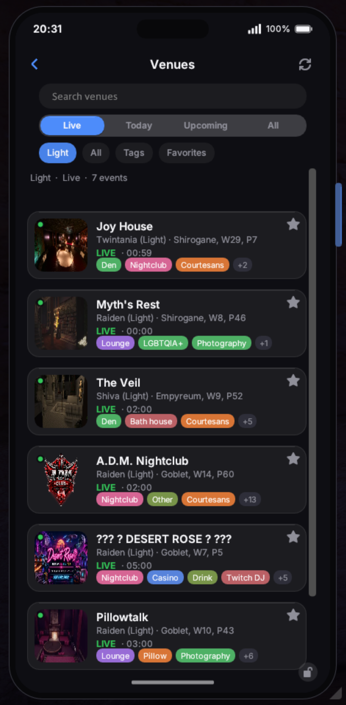
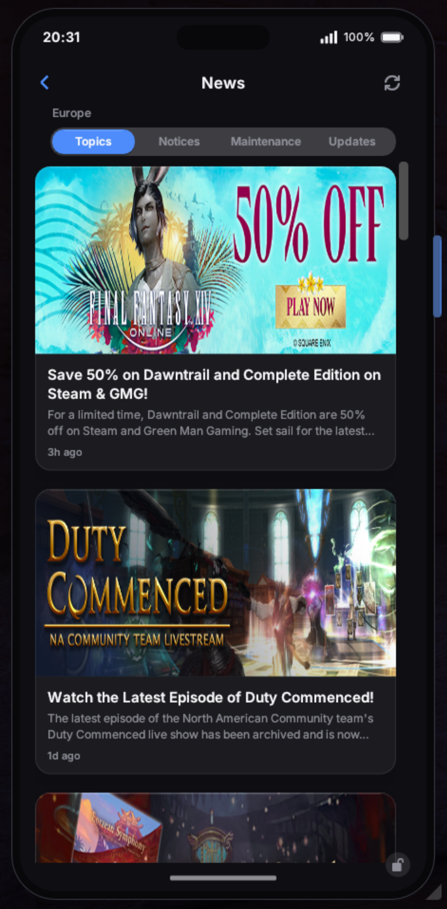
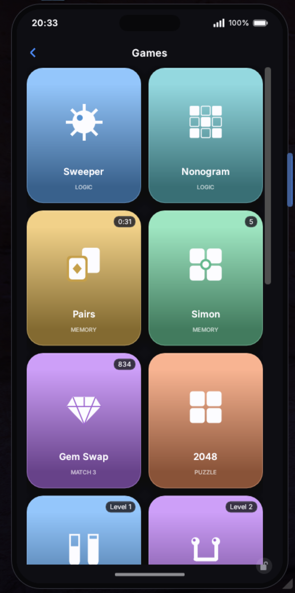

<p align="center">
  
</p>

<h1 align="center">Aetherphone</h1>

<p align="center">
  <a href="https://github.com/XeldarAlz/FFXIV-Aetherphone/releases/latest"></a>
  <a href="https://github.com/XeldarAlz/FFXIV-Aetherphone/releases"></a>
  <a href="https://github.com/XeldarAlz/FFXIV-Aetherphone/actions/workflows/release.yml"></a>
  <a href="LICENSE.md"></a>
</p>

<p align="center">
  <em>A smartphone, built for you. Built on Dalamud.</em>
</p>

---

<p align="center">
  
</p>

## What it does

Puts a real smartphone on screen: a docked, always-on device with a home screen, a status bar, app icons, notifications, ringtones, and themeable wallpapers. Its anchor is **Messages** — a chat client that absorbs the game's `/tell` system into bubbles you can read and reply to, with toast notifications and an unread badge on the server-info bar.

## Take a look

A few of the things you can do — message your contacts, listen to music, check the weather, search the market, hop between venues, and more.

<table>
  <tr>
    <td align="center" width="33%"><br /><sub><b>Message your contacts</b><br />Every <code>/tell</code> becomes a chat bubble</sub></td>
    <td align="center" width="33%"><br /><sub><b>Listen to music</b><br />Internet radio &amp; song search, in-game</sub></td>
    <td align="center" width="33%"><br /><sub><b>Check the weather</b><br />Live Eorzean forecast for your zone</sub></td>
  </tr>
  <tr>
    <td align="center"><br /><sub><b>Search the market</b><br />Live Universalis prices, stats &amp; trends</sub></td>
    <td align="center"><br /><sub><b>Find a venue</b><br />Live community events &amp; one-tap travel</sub></td>
    <td align="center"><br /><sub><b>Catch up on the news</b><br />Lodestone headlines for your region</sub></td>
  </tr>
  <tr>
    <td align="center"><br /><sub><b>Browse your contacts</b><br />Your friend list as an address book</sub></td>
    <td align="center"><br /><sub><b>Track your wallet</b><br />Gil, currencies, tomestones &amp; seals</sub></td>
    <td align="center"><br /><sub><b>Take a break</b><br />A pocket arcade of 15 mini-games</sub></td>
  </tr>
  <tr>
    <td align="center" colspan="3"><br /><sub><b>Now Playing</b><br />A dynamic island that follows your music</sub></td>
  </tr>
</table>

## Features

### The device

- **Home screen & shell**: a docked device with a status bar and a multi-page app grid. Long-press to enter edit mode, then drag icons to rearrange them across pages. Smooth slide transitions between every screen.
- **Lock screen**: a real lock screen with a large clock and date, your latest notifications stacked as cards (tap one to jump straight into its app), and a swipe to get back in.
- **Control Center**: swipe down for quick toggles — Do Not Disturb, position lock, idle scrolling — plus accent-color swatches, brightness (text size) and volume sliders, and live music controls.
- **Notifications**: a notification center, optional toasts, game-sound ringtones, and a Do Not Disturb switch.

### Apps

- **Messages**: reads incoming `/tell`s, lays them out as chat bubbles, and lets you reply — with notifications and an unread count.
- **Contacts**: your friend list as an address book, with Lodestone portraits; start a conversation straight from a contact.
- **Character**: a profile card for the local character, gear and Lodestone portrait included.
- **Skywatcher**: live Eorzean weather for your current zone, with a forecast for the hours ahead.
- **Venues**: browse community venues and events — nightclubs, bars, photography spots, and more — with live / upcoming filters, tag and name search, and favorites. One tap travels you there with Lifestream (or copies the command), or opens the venue's listing and Discord.
- **News**: the Lodestone feed for your region — Topics, Notices, Maintenance, and Updates — with images, maintenance windows, and a tap to open the full story.
- **Market**: live market board prices from Universalis — search any item (or right-click one in-game), see the cheapest listings, price stats, sale velocity, and recent-sale history with a trend graph across your World, Data Center, or Region. Set price-drop alerts that ping the phone, compare against NPC vendor prices, and star favorites.
- **Wallet**: track your gil, currencies, tomestones, hunt seals, and PvP marks at a glance, with progress toward weekly caps.
- **Music**: an in-game player — browse genre stations or search for any track, with playback controls and a Now Playing banner on the home screen.
- **Camera**: capture in-game shots straight from the phone, with square / photo / pano modes, an optional framing grid, and a flash.
- **Photos**: a gallery for your captures, laid out like a real photo library with a full-screen viewer.
- **Games**: a pocket arcade of 15 mini-games across logic, memory, match-3, and puzzle — Sweeper, Nonogram, Pairs, Simon, Gem Swap, 2048, Water Sort, Flow, Solitaire, Reversi, Breakout, Bubble Shooter, Snake, Flap, and Whack — each tracking your best score.
- **Clock**: an analog clock on Eorzea time.
- **Timers**: countdowns to the daily, Grand Company, and weekly resets, plus Fashion Report, Jumbo Cactpot, and Ocean Fishing windows and your retainer ventures — with optional reminders.

### Personalization

- **Themes & wallpapers**: pick an accent palette and a wallpaper — built-in art, one of your own photos, or any image you import; the whole device restyles to match.
- **Lodestone portraits**: real character avatars and portraits, pulled from the Lodestone and shown on your profile, contacts, and chats (toggleable).
- **Text size**: an accessibility zoom that scales the on-device type without resizing the phone.
- **Idle animation**: your character idly scrolls the phone (Tomescroll) when you're standing around — optional.
- **About window**: an animated credits & links screen, reachable from Settings or `/phone about`.

## Roadmap

Most of the original roadmap has shipped — Camera, Photos, Games, Market, Venues, News, Timers, custom wallpapers, and Lodestone portraits are all in. What's left is mostly the social layer, which waits on the backend.

- **Backend integration**: a server layer so the phone can sync data, persist state, and power the social apps below across characters and sessions. (The Aethernet account flow is already built and will switch on once the server is live.)
- **Friends**: add friends who also run Aetherphone, share stories, and keep up with each other in-game.
- **Aethergram**: an Instagram-style social feed — post photos, follow friends, and browse.
- **Chirper**: an X/Twitter-style microblog for short posts and timelines with your friends. (Built; gated behind the backend.)
- **In-game voice call**: call your friends in-game right from the phone.
- **Calendar**: events and reminders on Eorzean (and real) time.
- **Maps**: in-world navigation and points of interest.
- **Orchestrion**: a player for in-game tracks.
- **Memories**: a curated highlights view stitched from your photos and moments.

## Install

In-game: `/xlsettings` → **Experimental** → paste into **Custom Plugin Repositories**:

```
https://raw.githubusercontent.com/XeldarAlz/DalamudPlugins/main/repo.json
```

Tick **Enabled**, click **+**, then **Save and Close**. Open `/xlplugins` → **All Plugins**, search for **Aetherphone**, and install.

## Commands

| Command | Action |
|---|---|
| `/phone` | Toggle the phone |
| `/aetherphone` | Alias for `/phone` |
| `/phone about` | Open credits / links |

## More from me

If you liked this plugin, take a look at my other Dalamud work. You might find something else there for you.

→ [XeldarAlz Dalamud Plugins](https://github.com/XeldarAlz/DalamudPlugins)

## License

AGPL-3.0-or-later. See [LICENSE.md](LICENSE.md).
