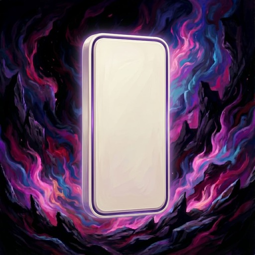
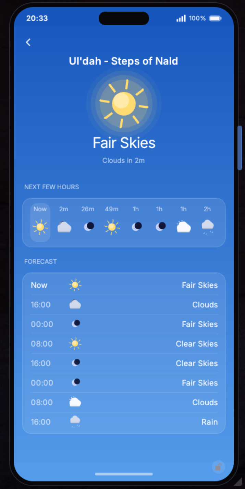

<p align="center">
  
</p>

<h1 align="center">Aetherphone</h1>

<p align="center">
  <a href="https://github.com/XeldarAlz/FFXIV-Aetherphone/releases/latest"></a>
  <a href="https://github.com/XeldarAlz/FFXIV-Aetherphone/releases"></a>
  <a href="https://github.com/XeldarAlz/FFXIV-Aetherphone/actions/workflows/release.yml"></a>
  <a href="LICENSE.md"></a>
</p>

<p align="center">
  <em>A smartphone, built for you. Built on Dalamud.</em>
</p>

---

<p align="center">
  
</p>

## What it does

Puts a real smartphone on screen: a docked, always-on device with a home screen, a status bar, app icons, notifications, ringtones, and themeable wallpapers. Its anchor is **Messages** — a chat client that absorbs the game's `/tell` system into bubbles you can read and reply to, with toast notifications and an unread badge on the server-info bar.

## Take a look

A few of the things you can do — listen to music, check the weather, search the market, message your contacts, and more.

<table>
  <tr>
    <td align="center" width="33%"><br /><sub><b>Message your contacts</b><br />Every <code>/tell</code> becomes a chat bubble</sub></td>
    <td align="center" width="33%"><br /><sub><b>Listen to music</b><br />Internet radio, sorted by genre</sub></td>
    <td align="center" width="33%"><br /><sub><b>Check the weather</b><br />Live Eorzean forecast for your zone</sub></td>
  </tr>
  <tr>
    <td align="center"><br /><sub><b>Search the market</b><br />Live Universalis prices, stats &amp; trends</sub></td>
    <td align="center"><br /><sub><b>Browse your contacts</b><br />Your friend list as an address book</sub></td>
    <td align="center"><br /><sub><b>Track your wallet</b><br />Gil, currencies, tomestones &amp; seals</sub></td>
  </tr>
  <tr>
    <td align="center" colspan="3"><br /><sub><b>Now Playing</b><br />A dynamic island that follows your music</sub></td>
  </tr>
</table>

## Features

- **Home screen & shell**: a docked device with a status bar, app grid, and smooth slide transitions between screens.
- **Messages**: reads incoming `/tell`s, lays them out as chat bubbles, and lets you reply — with notifications and an unread count.
- **Contacts**: your friend list as an address book; start a conversation straight from a contact.
- **My Character**: a profile card for the local character, gear and all.
- **Skywatcher**: live Eorzean weather for your current zone.
- **Market**: live market board prices from Universalis — search any item (or right-click one in-game), see the cheapest listings, price stats, sale velocity, and recent-sale history with a trend graph across your World, Data Center, or Region. Set price-drop alerts that ping the phone, compare against NPC vendor prices, and star favorites.
- **Wallet**: track your gil, currencies, tomestones, hunt seals, and PvP marks at a glance, with progress toward weekly caps.
- **Music**: an internet-radio player — pick a genre station and listen in-game, with a Now Playing banner on the home screen.
- **Clock**: an analog clock on Eorzea time.
- **Notifications**: a notification center, optional toasts, game-sound ringtones, and a Do Not Disturb switch.
- **Themes**: pick an accent palette and wallpaper; the whole device restyles to match.
- **About window**: an animated credits & links screen, reachable from Settings or `/phone about`.

## Roadmap

Planned work, roughly in order.

- **Backend integration**: a server layer so the phone can sync data, persist state, and power the social apps below across characters and sessions.
- **Camera**: capture in-game shots straight from the phone.
- **Photos**: a gallery for your captures, organized like a real photo library.
- **Friends**: add friends who also have Aetherphone plugin, share stories, do voice calls, and many moore.
- **Lodestone: integration** pull character profiles and portraits form the Lodestone of yourself and your friends.
- **Contacts profile pictures**: portraits on contacts cards, sourced from the Lodestone.
- **Custom Wallpapers**: set your own images as the device wallpaper.
- **In-game voice call**: call your friends in game right from the phone.
- **Aethergram**: an Instagram-style social feed — post photos, follow friends, and browse.
- **Chirper**: an X/Twitter-style microblog for short posts and timelines with your friends.
- **Calendar**: events and reminders on Eorzea (and real) time.
- **Maps**: in-world navigation and points of interest.
- **Orchestrion**: a music player for in-game tracks.
- **Memories**: a curated highlights view stitched from your photos and moments.
- **Alarms**: timers and alarms tied to game or real time.
- **Games**: small playable mini-games on the device.

## Install

In-game: `/xlsettings` → **Experimental** → paste into **Custom Plugin Repositories**:

```
https://raw.githubusercontent.com/XeldarAlz/DalamudPlugins/main/repo.json
```

Tick **Enabled**, click **+**, then **Save and Close**. Open `/xlplugins` → **All Plugins**, search for **Aetherphone**, and install.

## Commands

| Command | Action |
|---|---|
| `/phone` | Toggle the phone |
| `/aetherphone` | Alias for `/phone` |
| `/phone about` | Open credits / links |

## More from me

If you liked this plugin, take a look at my other Dalamud work. You might find something else there for you.

→ [XeldarAlz Dalamud Plugins](https://github.com/XeldarAlz/DalamudPlugins)

## License

AGPL-3.0-or-later. See [LICENSE.md](LICENSE.md).
